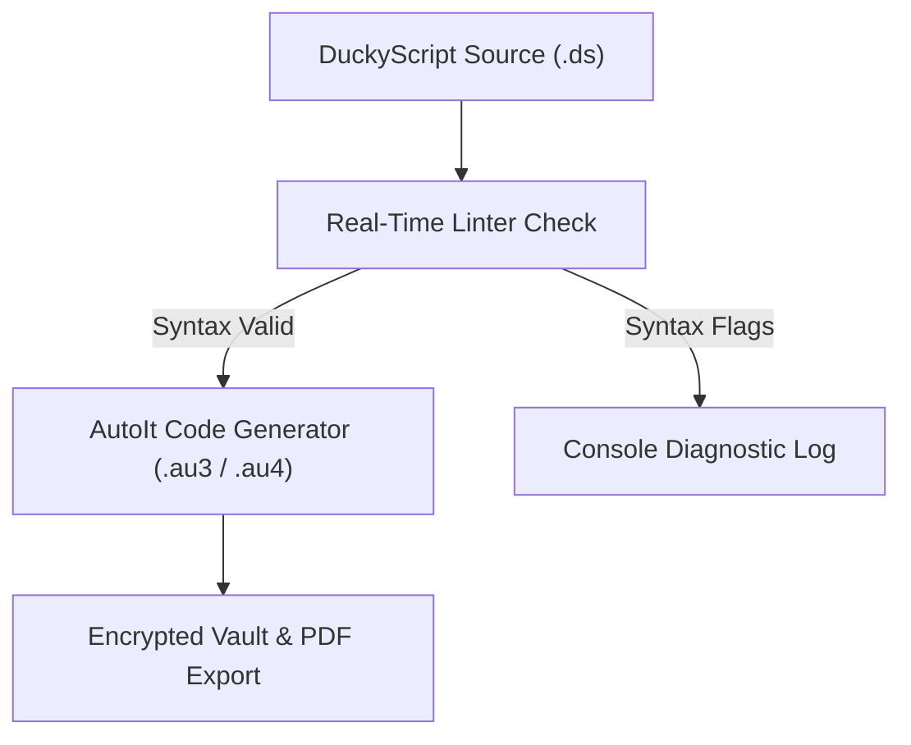

# <div align="center">🟢 LENLU SC // CYBERNETIC FORGE DECK 🟢</div>

<div align="center">
  
  *A high-fidelity command console for tactical keyboard payloads, spectrum telemetry scans, and neural scripting.*

  [](#)
  [](#)
  [](#)

</div>

---

> [!IMPORTANT]
> **SECURE ISOLATION NOTICE**
> LENLU SC runs client-side operations locally. Payloads and diagnostics do not leave your browser context unless explicitly requested via localized neural API endpoints.

---

## ⚡ SYSTEM OVERVIEW

LENLU SC is an immersive, hardware-accelerated dashboard designed to bridge the gap between human-readable keyboard scripts and target host compilation. The deck features a 3D Three.js particle core, a lateral smooth-scrolling GSAP portfolio, and real-time state persistence to ensure your work survives browser reloads.

Use the integrated payload workspace to write, lint, and compile DuckyScript into native AutoIt assemblies, configure AI-guided payload generation, or passive scan local networks.

---

## 🛠️ THE CORE CHAMBERS

### 1. 💻 Integrated Payload Workbench
* **DuckyScript Compiler**: Instantly parses keystroke injection scripts into native AutoIt (`.au3` & `.au4`) macros.
* **Real-time Linter**: Scans code continuously, flagging syntax errors, missing arguments, or invalid commands before compilation.
* **Session Persistence**: Caches editor text, compiled script outputs, and terminal log files in local memory so they persist on page refresh.

### 2. 🧠 Neural Synthesis Lab
* **Multi-Model Uplink**: Connects custom neural endpoints (Groq, OpenAI, or custom LLM gateways).
* **Voice Dictation**: Leverages speech-to-text models to dictate payload logic or commands.
* **Stealth Calibrator**: Calibrates sleep delays to tune execution speed or bypass host detection.

### 3. 📡 Network Surveillance HUD
* **802.11 Scanner**: Simulates wireless airspace scans listing active ESSIDs and signal ranges.
* **BLE Tracker**: Traces surrounding Bluetooth Low Energy node signatures and tags.
* **Deauth Monitor**: Identifies channel spikes and tracks active deauthentication packet streams.

### 4. 🗄️ Secure Vault & Export
* **Encrypted Sandbox**: Stash payload drafts directly in the browser's database.
* **PDF Session Logger**: Exports audit-ready, dark-themed PDF diagnostic reports containing compilation statistics and debug outputs.

---

## 🔄 COMPILATION FLOW



---

## 📁 DIRECTORY STRUCTURE

- [index.html](file:///c:/Users/arune/OneDrive/Documents/github_f/code%20convetor/index.html) — Core dashboard housing the WebGL engine, compiler loops, AI generator, scanners, settings, and state persistence.
- [studio.html](file:///c:/Users/arune/OneDrive/Documents/github_f/code%20convetor/studio.html) — Lateral portfolio showing system architectures and core operations modules with 3D canvas rings and parallax scroll effects.
- [IMGS/](file:///c:/Users/arune/OneDrive/Documents/github_f/code%20convetor/IMGS/) — High-fidelity cybernetic assets linking background cards:
  - [ide_workspace.png](file:///c:/Users/arune/OneDrive/Documents/github_f/code%20convetor/IMGS/ide_workspace.png) — Integrated Workbench Card.
  - [ai_generator.png](file:///c:/Users/arune/OneDrive/Documents/github_f/code%20convetor/IMGS/ai_generator.png) — AI Synthesis Lab Card.
  - [scanner_systems.png](file:///c:/Users/arune/OneDrive/Documents/github_f/code%20convetor/IMGS/scanner_systems.png) — Signal Scanners Card.
  - [matrix_logs.png](file:///c:/Users/arune/OneDrive/Documents/github_f/code%20convetor/IMGS/matrix_logs.png) — Matrix Logs Construct.
  - [glass_cards.png](file:///c:/Users/arune/OneDrive/Documents/github_f/code%20convetor/IMGS/glass_cards.png) — Glass Cards Construct.
  - [terminal_interfaces.png](file:///c:/Users/arune/OneDrive/Documents/github_f/code%20convetor/IMGS/terminal_interfaces.png) — Terminal Interfaces Construct.

---

## 💻 COMPILATION SAMPLE

### Input DuckyScript (`payload.ds`)
```duckyscript
REM Spawn Powershell and run script
GUI r
DELAY 300
STRING powershell.exe -NoP -NonI -W Hidden
ENTER
```

### Output AutoIt Assembly (`assembly.au3`)
```autoit
; LENLU SC - GENERATED ASSEMBLY
#NoTrayIcon
#include <Misc.au3>

; REM Spawn Powershell and run script
Send("{LWIN}")
Sleep(100)
Send("r")
Sleep(100)
Sleep(300)
Send("powershell.exe -NoP -NonI -W Hidden")
Sleep(100)
Send("{ENTER}")
Sleep(100)
```

---

## 🚀 UPLINK PROCEDURE

1. Boot the terminal by launching [index.html](file:///c:/Users/arune/OneDrive/Documents/github_f/code%20convetor/index.html) in any WebGL compatible browser.
2. Select **ESTABLISH LINK** on the splash screen to boot the matrix grid (reloads bypass this automatically).
3. Type or paste code inside the **Payload Workbench** and hit **Compile** to generate AutoIt outputs.
4. Input your neural model key in **Settings** to unlock the AI Generator synthesis.
5. Save script presets inside the **Encrypted Vault** or download them as `.au3` / `.au4` files.
6. Export auditing logs using the **Export PDF** tool.

---

## ⚙️ TELEMETRY METRICS

| Parameter | State | Description |
| :--- | :--- | :--- |
| **Compiler Pipeline** | `CALIBRATED` | Full conversion map of DuckyScript modifiers, delays, and strings. |
| **WebGL Shaders** | `ACTIVE` | Ambient parallax particle matrices rendering at 60 FPS target. |
| **Session Cache** | `ENABLED` | LocalStorage tracking active tab views, editor code, and compile output logs. |
| **Encryption Mode** | `SANDBOX` | Client-side client memory only. Data remains inside your local browser. |

---

<div align="center">
  
  **// END OF LINE.** // Maintain precision. Assemble with control.

</div>
