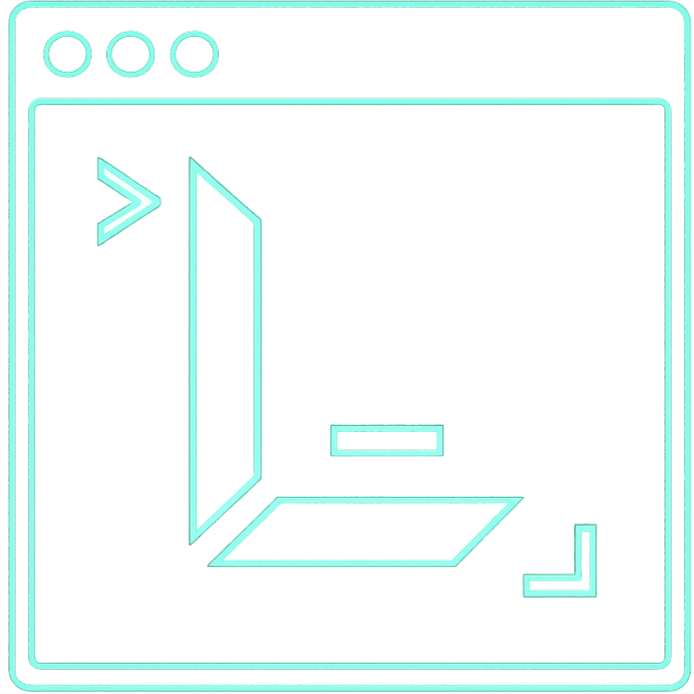
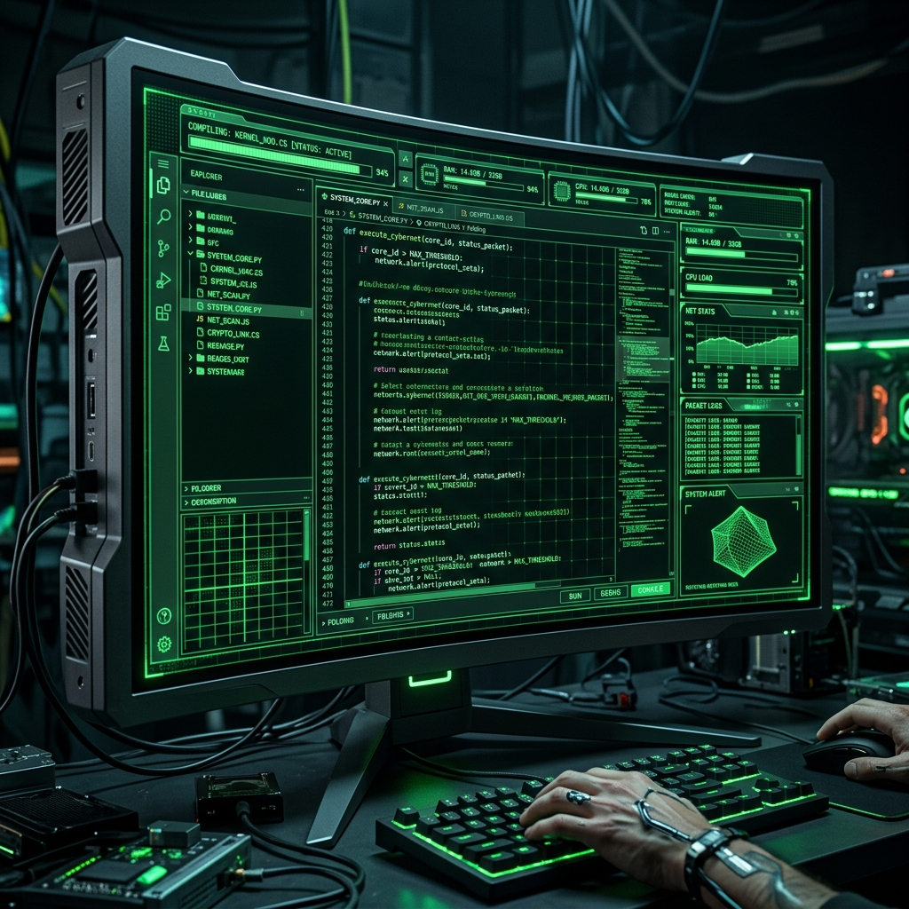
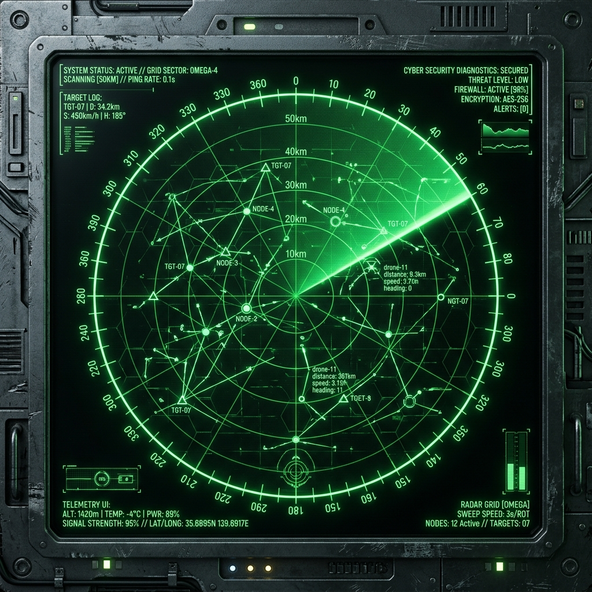
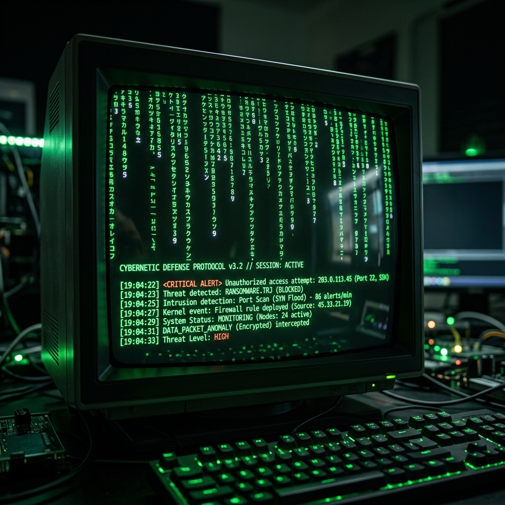
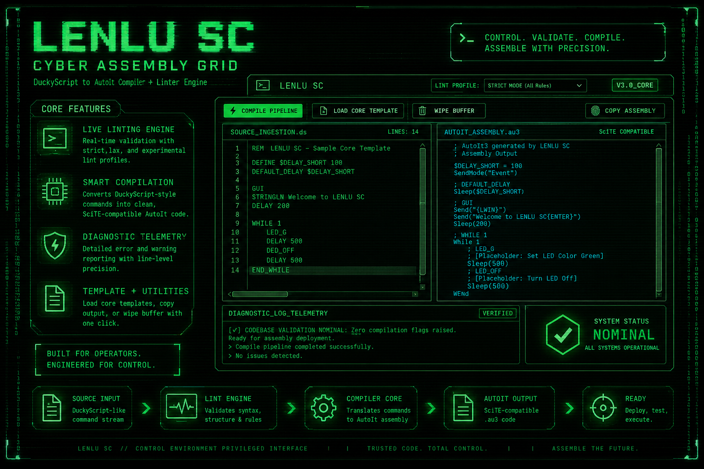
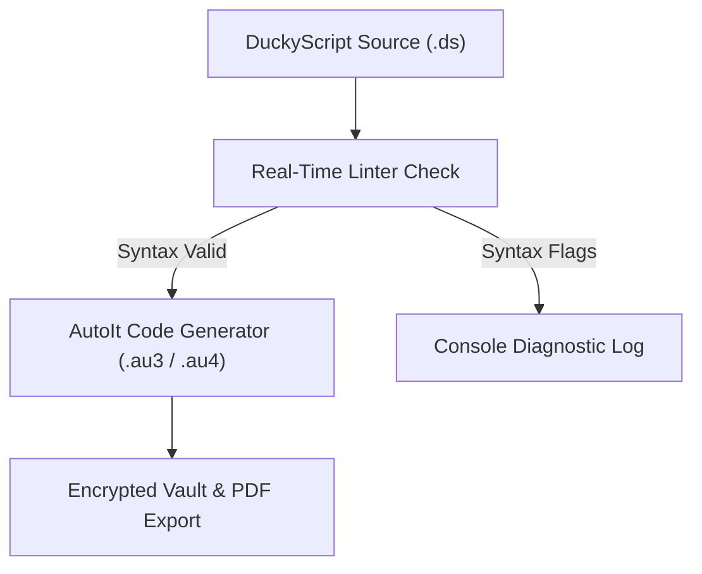

# <div align="center"><br>🟢 LENLU SC // CYBERNETIC FORGE DECK & MOBILE UPLINK 🟢</div>

<div align="center">
  
  *A high-fidelity command console and mobile terminal for tactical keyboard payloads, spectrum telemetry scans, and neural scripting.*

  [](#)
  [](#)
  [](#)

</div>

---

> [!IMPORTANT]
> **SECURE ISOLATION NOTICE**
> LENLU SC runs client-side operations locally. Payloads and diagnostics do not leave your browser or device context unless explicitly requested via user-configured neural API endpoints.

---

## ⚡ SYSTEM OVERVIEW

LENLU SC is an immersive, hardware-accelerated command console designed to bridge the gap between human-readable keyboard scripts and target host executable packages. 

The console features:
- A real-time **DuckyScript Linter and Compiler** targeting AutoIt3 scripting.
- An **AI Neural Synthesis Lab** for speech-dictated or prompt-based payload generation.
- A **Signal Scanners HUD** for wireless BLE scanning, local port mapping, WebRTC diagnostics, and live DNS queries.
- A dynamic cybernetic visual interface featuring a **3D Three.js particle core**, retro **CRT screen scanlines**, **chromatic aberration**, and smooth **GSAP animations**.

To extend accessibility, the **LENLU SC Android Application** (`appp` module) wraps this high-fidelity WebGL system inside a native container, optimizing rendering speed and automatically calibrating safe display boundaries.

---

## 🖼️ INTERFACE SHOWCASE

<table align="center" style="border-collapse: collapse; border: none; width: 100%;">
  <tr style="border: none;">
    <td align="center" width="50%" style="border: none; padding: 10px; vertical-align: top;">
      <b>💻 Integrated Payload Workbench</b><br>
      <sub>Real-time DuckyScript linter, compiler, and local memory session cache.</sub><br><br>
      
    </td>
    <td align="center" width="50%" style="border: none; padding: 10px; vertical-align: top;">
      <b>🧠 Neural Synthesis Lab</b><br>
      <sub>Multi-model AI uplink with voice dictation and delay speed tuning.</sub><br><br>
      
    </td>
  </tr>
  <tr style="border: none;">
    <td align="center" width="50%" style="border: none; padding: 10px; vertical-align: top;">
      <b>📡 Network Surveillance HUD</b><br>
      <sub>Airspace simulation logging Wi-Fi networks, BLE node signatures, and packet streams.</sub><br><br>
      
    </td>
    <td align="center" width="50%" style="border: none; padding: 10px; vertical-align: top;">
      <b>📱 LENLU SC Android Wrapper</b><br>
      <sub>Edge-to-edge Native WebView container with hardware acceleration and API bridge.</sub><br><br>
      
    </td>
  </tr>
</table>

<details>
<summary><b>🔍 View Extended System Constructs</b></summary>
<br>
<table align="center" style="border-collapse: collapse; border: none; width: 100%;">
  <tr style="border: none;">
    <td align="center" width="33%" style="border: none; padding: 5px; vertical-align: top;">
      <br>
      <sub>Matrix Log Telemetry</sub>
    </td>
    <td align="center" width="33%" style="border: none; padding: 5px; vertical-align: top;">
      <br>
      <sub>Glassmorphic Cards</sub>
    </td>
    <td align="center" width="33%" style="border: none; padding: 5px; vertical-align: top;">
      <br>
      <sub>Terminal Console HUD</sub>
    </td>
  </tr>
</table>
</details>

---

## 🛠️ THE CORE CHAMBERS

### 1. 💻 Integrated Payload Workbench
- **DuckyScript Parser & Compiler**: Translates keystroke injection commands (`DELAY`, `STRING`, `GUI`, `ENTER`, etc.) directly into executable AutoIt3 (`.au3`/`.au4`) assembly code structures.
- **Real-Time Interactive Linter**: Continuously evaluates typed scripts inside the editor. It catches syntax anomalies, invalid keywords, and missing arguments immediately, rendering warning/error decorators in the compiler logs.
- **Session Cache & Memory**: Seamlessly saves your workspace configuration, editor contents, terminal outputs, and selected tab index into local web storage. Reloading the browser does not lose your current session.

### 2. 🧠 Neural Synthesis Lab
- **Multi-Model AI uplink**: Allows connecting to advanced AI language endpoints (e.g., Groq, OpenAI, or Anthropic) by entering your private token in the settings card.
- **Voice Payload Builder**: Utilizes the browser's speech recognition APIs to translate voice commands into functional script logic.
- **Stealth Calibration**: Provides a delay calibrator that scales all execution timers inside the compiled scripts, letting you adjust timing constraints to bypass host defenses.

### 3. 📡 Network Surveillance HUD
- **Live BLE Node Discovery**: Employs the **Web Bluetooth API** (supported in Chrome/Edge) to perform real-time scans of surrounding Bluetooth Low Energy signals, displaying device identifiers and RSSI values.
- **Simulated Airspace Scan**: Simulates active 802.11 network scanning, tracking simulated ESSIDs, channel allocations, and deauthentication event logs.
- **DNS Surveillance**: Resolves real domains using Cloudflare's **DNS-over-HTTPS (DoH)** API directly inside the client dashboard.
- **WebRTC IP Leak Checker**: Queries local RTC candidate tables to output the current user's local and public IPv4/IPv6 endpoints.
- **Local Port Sweeper**: Performs asynchronous WebSocket connection sweeps across common localhost development ports (e.g., `80`, `443`, `3000`, `8080`) to log active network endpoints on the user's host machine.

### 4. 🗄️ Secure Vault & Export
- **Encrypted Database Sandbox**: Saves custom payload drafts inside the local browser storage context, sandbox-isolated from other websites.
- **Dark-Themed PDF Audits**: Exports detailed documentation containing source code, compiled assembly, compiler flags, and build statistics into a ready-to-share PDF report.

---

## 📱 LENLU SC ANDROID APPLICATION

The **Android companion application** wraps the WebGL console inside a native Android container (`appp` module), maximizing performance and adapting the interface to phone form factors.

### Core Architecture & Implementations:
1. **Edge-to-Edge Fluidity**: 
   The application enables full-screen rendering using:
   ```kotlin
   WindowCompat.setDecorFitsSystemWindows(window, false)
   window.statusBarColor = Color.TRANSPARENT
   ```
   It captures display insets dynamically via `WindowInsetsCompat` and exposes the status bar offset (`topInsetDp`) to the WebView DOM as a CSS custom property:
   ```kotlin
   webView.evaluateJavascript("document.documentElement.style.setProperty('--safe-top', '${topInsetDp}px')", null)
   ```
   This ensures visual panels adapt to devices with status bar offsets, curved corners, or camera notches.

2. **GPU Hardware Acceleration**: 
   The WebView container is configured with hardware-accelerated drawing layers to ensure smooth rendering of the Three.js 3D hologram grids, gsaps, and retro terminal scanlines.

3. **WebView Configuration**:
   The web rendering configuration is tuned for asset storage and modern web operations:
   - Enabling JavaScript execution and DOM Database storage mechanisms.
   - Enforcing local file and content access (`allowFileAccess = true`, `allowContentAccess = true`).
   - Mixed content mode is set to always allow HTTPS/HTTP assets inside the local package scope.

4. **Traversal Navigation**:
   The activity intercepts hardware back key gestures using `onBackPressed()`. Instead of immediately exiting the application, it navigates backward through the WebView page history (`webView.goBack()`) if it's available.

### App Target Specifications:
- **Package Namespace / Application ID**: `com.lenlu.sc`
- **Compile SDK Version**: API Level 34 (Android 14)
- **Target SDK Version**: API Level 34 (Android 14)
- **Minimum SDK Version**: API Level 24 (Android 7.0)
- **Primary Source File**: [MainActivity.kt](./appp/src/main/java/com/lenlu/sc/MainActivity.kt)

---

## 🔄 COMPILATION FLOW



---

## 📁 DIRECTORY STRUCTURE

- [index.html](./index.html) — Core desktop dashboard hosting WebGL shaders, compiler engine, scanners, and settings panels.
- [studio.html](./studio.html) — Dynamic lateral portfolio displaying architectural overlays with GSAP scroll links.
- [IMGS/](./IMGS/) — High-fidelity branding elements and dashboard mockup assets:
  - [logo_nav_bar.png](./IMGS/logo_nav_bar.png) — Vector-aligned nav deck logo.
  - [ide_workspace.png](./IMGS/ide_workspace.png) — Workbench workspace preview.
  - [ai_generator.png](./IMGS/ai_generator.png) — Neural Synthesis workbench preview.
  - [scanner_systems.png](./IMGS/scanner_systems.png) — Signal scanners panel preview.
- [appp/](./appp/) — Android application workspace module:
  - [appp/src/main/java/com/lenlu/sc/MainActivity.kt](./appp/src/main/java/com/lenlu/sc/MainActivity.kt) — Native WebView coordinator, status bar translucency, safe top inset updater, and back history handler.
  - [appp/src/main/assets/htm.html](./appp/src/main/assets/htm.html) — Local web UI rendered inside the mobile application WebView.
  - [appp/build.gradle](./appp/build.gradle) — Build and compiler targeting configuration.

---

## 💻 COMPILATION SAMPLE

### Input DuckyScript (`payload.ds`)
```duckyscript
REM Spawn Powershell and run script
GUI r
DELAY 300
STRING powershell.exe -NoP -NonI -W Hidden
ENTER
```

### Output AutoIt Assembly (`assembly.au3`)
```autoit
; LENLU SC - GENERATED ASSEMBLY
#NoTrayIcon
#include <Misc.au3>

; REM Spawn Powershell and run script
Send("{LWIN}")
Sleep(100)
Send("r")
Sleep(100)
Sleep(300)
Send("powershell.exe -NoP -NonI -W Hidden")
Sleep(100)
Send("{ENTER}")
Sleep(100)
```

---

## 🚀 UPLINK PROCEDURE

### Web Console
1. Run the terminal console by launching [index.html](./index.html) in a WebGL-compatible browser.
2. Select **ESTABLISH LINK** on the splash screen to boot the matrix grid (reloads bypass this automatically).
3. Input script content inside the **Payload Workbench** and select **Compile** to generate AutoIt script logs.
4. Input your AI models key in the **Settings** card to activate the AI synthesis features.
5. Save draft presets inside the **Encrypted Vault** or download them directly as file structures.

### Android Application
1. Import the root repository in **Android Studio**.
2. Allow Gradle sync to complete and resolve target libraries.
3. Build and execute the application on an emulator or standard hardware device running Android 7.0+ (API 24+).

---

## ⚙️ TELEMETRY METRICS

| Parameter | State | Description |
| :--- | :--- | :--- |
| **Compiler Pipeline** | `CALIBRATED` | Full conversion map of DuckyScript modifiers, delays, and strings. |
| **WebGL Shaders** | `ACTIVE` | Ambient parallax particle matrices rendering at 60 FPS target. |
| **Session Cache** | `ENABLED` | LocalStorage tracking active tab views, editor code, and compile output logs. |
| **Encryption Mode** | `SANDBOX` | Client-side client memory only. Data remains inside your local browser. |
| **Android Inset Bridge** | `OPERATIONAL` | Calculates dynamic device offsets to optimize layout on curved screen mobiles. |
| **Neural Synthesis Uplink** | `STANDBY` | Remote neural endpoint connection for automated payload generation. |

---

<div align="center">
  
  **// END OF LINE.** // Maintain precision. Assemble with control.

</div>
