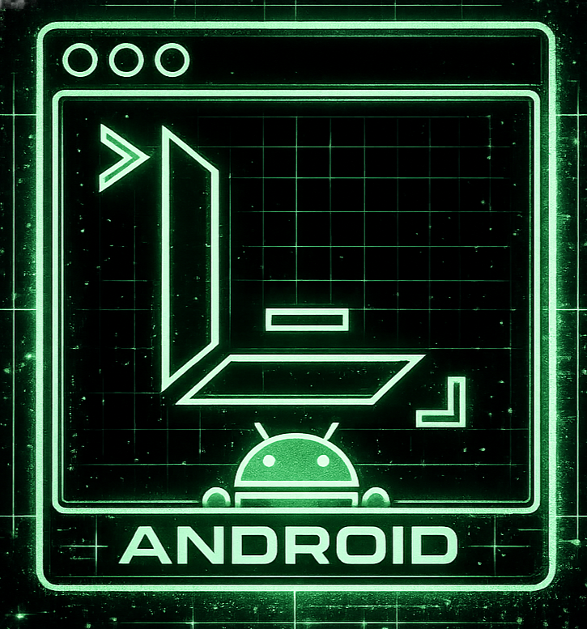
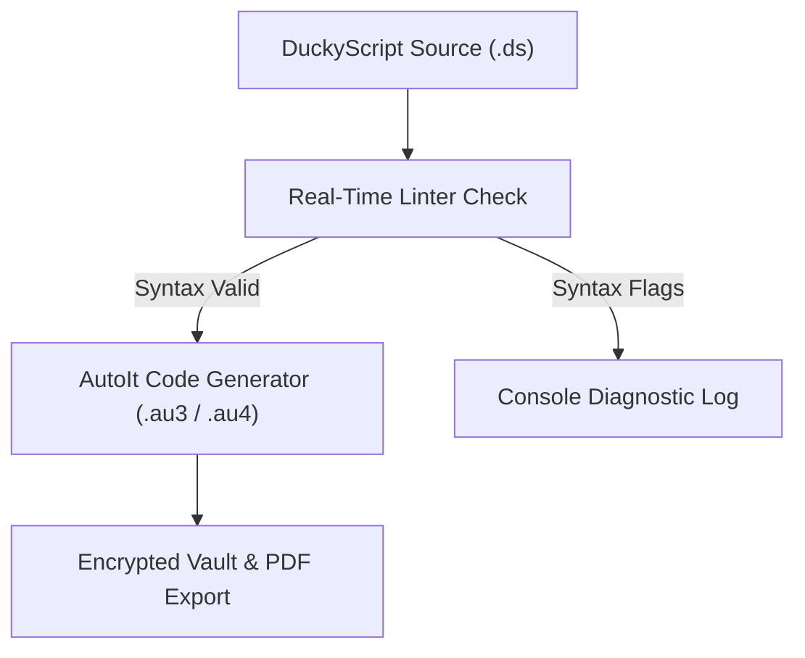

# <div align="center"><br>🟢 LENLU SC // CYBERNETIC FORGE DECK & MOBILE UPLINK 🟢</div>

<div align="center">
  
  *A high-fidelity command console and mobile terminal for tactical keyboard payloads, spectrum telemetry scans, and neural scripting.*

  [](#)
  [](#)
  [](#)

</div>

---

> [!IMPORTANT]
> **SECURE ISOLATION NOTICE**
> LENLU SC runs client-side operations locally. Payloads and diagnostics do not leave your browser or device context unless explicitly requested via localized neural API endpoints.

---

## ⚡ SYSTEM OVERVIEW

LENLU SC is an immersive, hardware-accelerated dashboard designed to bridge the gap between human-readable keyboard scripts and target host compilation. The deck features a 3D Three.js particle core, a lateral smooth-scrolling GSAP portfolio, and real-time state persistence to ensure your work survives browser reloads.

In addition to the Web Console, the **LENLU SC Android Application** extends this workspace to mobile form factors. It wraps the WebGL core inside a native hardware-accelerated WebView container, injecting display insets dynamically for a borderless, edge-to-edge experience.

---

## 🖼️ INTERFACE SHOWCASE

<table align="center" style="border-collapse: collapse; border: none; width: 100%;">
  <tr style="border: none;">
    <td align="center" width="50%" style="border: none; padding: 10px; vertical-align: top;">
      <b>💻 Integrated Payload Workbench</b><br>
      <sub>Real-time DuckyScript linter, compiler, and local memory session cache.</sub><br><br>
      
    </td>
    <td align="center" width="50%" style="border: none; padding: 10px; vertical-align: top;">
      <b>🧠 Neural Synthesis Lab</b><br>
      <sub>Multi-model AI uplink with voice dictation and delay speed tuning.</sub><br><br>
      
    </td>
  </tr>
  <tr style="border: none;">
    <td align="center" width="50%" style="border: none; padding: 10px; vertical-align: top;">
      <b>📡 Network Surveillance HUD</b><br>
      <sub>Airspace simulation logging Wi-Fi networks, BLE node signatures, and packet streams.</sub><br><br>
      
    </td>
    <td align="center" width="50%" style="border: none; padding: 10px; vertical-align: top;">
      <b>📱 LENLU SC Android Wrapper</b><br>
      <sub>Edge-to-edge Native WebView container with hardware acceleration and API bridge.</sub><br><br>
      
    </td>
  </tr>
</table>

<details>
<summary><b>🔍 View Extended System Constructs</b></summary>
<br>
<table align="center" style="border-collapse: collapse; border: none; width: 100%;">
  <tr style="border: none;">
    <td align="center" width="33%" style="border: none; padding: 5px; vertical-align: top;">
      <br>
      <sub>Matrix Log Telemetry</sub>
    </td>
    <td align="center" width="33%" style="border: none; padding: 5px; vertical-align: top;">
      <br>
      <sub>Glassmorphic Cards</sub>
    </td>
    <td align="center" width="33%" style="border: none; padding: 5px; vertical-align: top;">
      <br>
      <sub>Terminal Console HUD</sub>
    </td>
  </tr>
</table>
</details>

---

## 🛠️ THE CORE CHAMBERS

### 1. 💻 Integrated Payload Workbench
* **DuckyScript Compiler**: Instantly parses keystroke injection scripts into native AutoIt (`.au3` & `.au4`) macros.
* **Real-time Linter**: Scans code continuously, flagging syntax errors, missing arguments, or invalid commands before compilation.
* **Session Persistence**: Caches editor text, compiled script outputs, and terminal log files in local memory so they persist on page refresh.

### 2. 🧠 Neural Synthesis Lab
* **Multi-Model Uplink**: Connects custom neural endpoints (Groq, OpenAI, or custom LLM gateways).
* **Voice Dictation**: Leverages speech-to-text models to dictate payload logic or commands.
* **Stealth Calibrator**: Calibrates sleep delays to tune execution speed or bypass host detection.

### 3. 📡 Network Surveillance HUD
* **802.11 Scanner**: Simulates wireless airspace scans listing active ESSIDs and signal ranges.
* **BLE Tracker**: Traces surrounding Bluetooth Low Energy node signatures and tags.
* **Deauth Monitor**: Identifies channel spikes and tracks active deauthentication packet streams.

### 4. 🗄️ Secure Vault & Export
* **Encrypted Sandbox**: Stash payload drafts directly in the browser's database.
* **PDF Session Logger**: Exports audit-ready, dark-themed PDF diagnostic reports containing compilation statistics and debug outputs.

---

## 📱 LENLU SC ANDROID APPLICATION

The Android terminal expands the reach of the cybernetic deck, compiling and running inside a high-performance native container.

### Core App Implementations:
* **Edge-to-Edge Fluidity**: Automatically queries Android system window insets via `WindowInsetsCompat` and injects the dynamic status bar height `--status-bar-height` as a CSS custom property into the DOM. This provides an immersive, bezel-free panel UI.
* **GPU Hardware Acceleration**: Enables native hardware layers (`LAYER_TYPE_HARDWARE`) on the rendering viewport to guarantee fluid Three.js 3D particle animations and scroll events.
* **Hybrid Javascript Bridge (`AndroidInterface`)**:
  - `openUrl(url)`: Directs links out of the sandbox and executes native `Intent.ACTION_VIEW` actions.
  - `sendEmail(subject, body)`: Triggers Android's native email chooser addressing `lenluarun@gmail.com` to export raw payload scripts.
  - `runNativeScan(type)`: Exposes a callback hooks framework designed for binding actual device sensors (Wi-Fi/BLE) to the scanning interfaces.
* **Seamless Back Navigation**: Integrates into the Activity's `onBackPressedDispatcher`, redirecting physical back gestures to step through the WebView history or safely shut down the instance.

### App Target Specifications:
* **Package Name**: `com.example.lenlusc`
* **Compile SDK**: Android 16 (API Level 36)
* **Target SDK**: API Level 36
* **Minimum SDK**: Android 7.0 (API Level 24)

---

## 🔄 COMPILATION FLOW



---

## 📁 DIRECTORY STRUCTURE

- [index.html](./index.html) — Core dashboard housing the WebGL engine, compiler loops, AI generator, scanners, settings, and state persistence.
- [studio.html](./studio.html) — Lateral portfolio showing system architectures and core operations modules with 3D canvas rings and parallax scroll effects.
- [IMGS/](./IMGS/) — High-fidelity cybernetic assets, screenshots, and visual branding assets:
  - [logo_nav_bar.png](./IMGS/logo_nav_bar.png) — Vector-aligned nav deck logo.
  - [ide_workspace.png](./IMGS/ide_workspace.png) — Integrated Workbench Card.
  - [ai_generator.png](./IMGS/ai_generator.png) — AI Synthesis Lab Card.
  - [scanner_systems.png](./IMGS/scanner_systems.png) — Signal Scanners Card.
  - [matrix_logs.png](./IMGS/matrix_logs.png) — Matrix Logs Construct.
  - [glass_cards.png](./IMGS/glass_cards.png) — Glass Cards Construct.
  - [terminal_interfaces.png](./IMGS/terminal_interfaces.png) — Terminal Interfaces Construct.
- [LENLUSC/](./LENLUSC/) — Android Kotlin application root directory:
  - [app/src/main/java/com/example/lenlusc/MainActivity.kt](./LENLUSC/app/src/main/java/com/example/lenlusc/MainActivity.kt) — WebView host logic, JavaScript interfaces, back-history control, and insets calculations.
  - [app/src/main/assets/](./LENLUSC/app/src/main/assets/) — Embedded static assets mirror serving local terminal interface layers.
  - [IMGS/apk.png](./LENLUSC/IMGS/apk.png) — Android screenshot showing mobile wrapper styling.

---

## 💻 COMPILATION SAMPLE

### Input DuckyScript (`payload.ds`)
```duckyscript
REM Spawn Powershell and run script
GUI r
DELAY 300
STRING powershell.exe -NoP -NonI -W Hidden
ENTER
```

### Output AutoIt Assembly (`assembly.au3`)
```autoit
; LENLU SC - GENERATED ASSEMBLY
#NoTrayIcon
#include <Misc.au3>

; REM Spawn Powershell and run script
Send("{LWIN}")
Sleep(100)
Send("r")
Sleep(100)
Sleep(300)
Send("powershell.exe -NoP -NonI -W Hidden")
Sleep(100)
Send("{ENTER}")
Sleep(100)
```

---

## 🚀 UPLINK PROCEDURE

### Web Terminal
1. Boot the terminal by launching [index.html](./index.html) in any WebGL compatible browser.
2. Select **ESTABLISH LINK** on the splash screen to boot the matrix grid (reloads bypass this automatically).
3. Type or paste code inside the **Payload Workbench** and hit **Compile** to generate AutoIt outputs.
4. Input your neural model key in **Settings** to unlock the AI Generator synthesis.
5. Save script presets inside the **Encrypted Vault** or download them as `.au3` / `.au4` files.
6. Export auditing logs using the **Export PDF** tool.

### Android Application
1. Open the [LENLUSC/](./LENLUSC/) directory in Android Studio.
2. Allow Gradle sync to complete and download appropriate dependencies (Target SDK 36, Kotlin JDK 11).
3. Run or build the app on an emulator or a physical device running Android 7.0 (API 24) or higher.

---

## ⚙️ TELEMETRY METRICS

| Parameter | State | Description |
| :--- | :--- | :--- |
| **Compiler Pipeline** | `CALIBRATED` | Full conversion map of DuckyScript modifiers, delays, and strings. |
| **WebGL Shaders** | `ACTIVE` | Ambient parallax particle matrices rendering at 60 FPS target. |
| **Session Cache** | `ENABLED` | LocalStorage tracking active tab views, editor code, and compile output logs. |
| **Encryption Mode** | `SANDBOX` | Client-side client memory only. Data remains inside your local browser. |
| **Android Inset Bridge** | `OPERATIONAL` | Calculates dynamic device offsets to optimize layout on curved screen mobiles. |

---

<div align="center">
  
  **// END OF LINE.** // Maintain precision. Assemble with control.

</div>
