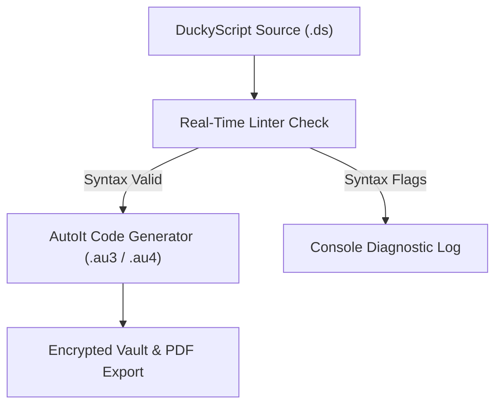

# <div align="center"><br>🟢 LENLU SC // CYBERNETIC FORGE DECK & MOBILE UPLINK 🟢</div>

<div align="center">

*A premium, high-fidelity command console and mobile terminal wrapper for real-world cryptographic audits, network scans, DuckyScript payload compilation, and hardware flashing.*

[](#)
[](#)
[](#)

</div>

---

> [!IMPORTANT]
> **SECURE CLIENT-SIDE ISOLATION NOTICE**
> LENLU SC runs client-side operations locally. Payloads and diagnostics do not leave your browser or device context unless explicitly requested via user-configured neural API endpoints.

---

## ⚡ SYSTEM OVERVIEW

LENLU SC is an immersive, hardware-accelerated command console designed to bridge the gap between human-readable keyboard scripts and target host executable packages. 

The console features:
* 🛠️ **DuckyScript Linter and Compiler**: Translates keystroke injection scripts directly into compiled AutoIt3 executables with real-time error checking.
* 🧠 **Neural Synthesis Lab**: Multi-model AI payload generation featuring voice dictation controls and stealth timing auto-calibrators.
* 📡 **Network Surveillance HUD**: Real DNS resolutions, service scanners (SSH, HTTP, HTTPS, DB, Cache services), local WebSocket sweepers, and microphone frequency analyzers via Web Audio API.
* 🔌 **Hardware WebUSB Flasher**: Directly streams payloads to Flipper Zero (BadUSB), Rubber Ducky, or Arduino controllers using chunked transmissions.
* 🔓 **Web Crypto Hash Cracker**: Performs real-time dictionary attacks and brute-force hash-cracking utilizing Web Worker multi-threading.
* 🎨 **Dual Aesthetic Engines**: Switch instantly between **Cybernetic Neon** and a warm, tactile **Skeuomorphic Analog** (brass dials, vacuum tubes, mechanical toggle switches) layout.

---

## 🖼️ INTERFACE SHOWCASE

<table align="center" style="border-collapse: collapse; border: none; width: 100%;">
  <tr style="border: none;">
    <td align="center" width="50%" style="border: none; padding: 10px; vertical-align: top;">
      <b>💻 Integrated Payload Workbench</b><br>
      <sub>Real-time DuckyScript linter, compiler, and local memory session cache.</sub><br><br>
      
    </td>
    <td align="center" width="50%" style="border: none; padding: 10px; vertical-align: top;">
      <b>🧠 Neural Synthesis Lab</b><br>
      <sub>Multi-model AI uplink with voice dictation and delay speed tuning.</sub><br><br>
      
    </td>
  </tr>
  <tr style="border: none;">
    <td align="center" width="50%" style="border: none; padding: 10px; vertical-align: top;">
      <b>📡 Network Surveillance HUD</b><br>
      <sub>Airspace simulation logging Wi-Fi networks, BLE node signatures, and packet streams.</sub><br><br>
      
    </td>
    <td align="center" width="50%" style="border: none; padding: 10px; vertical-align: top;">
      <b>📱 LENLU SC Android Wrapper</b><br>
      <sub>Edge-to-edge Native WebView container with hardware acceleration and API bridge.</sub><br><br>
      
    </td>
  </tr>
</table>

---

## 🛠️ CORE CHAMBERS

### 1. 💻 Integrated Payload Workbench
* **DuckyScript Compiler**: Translates keystroke inject scripts (`DELAY`, `STRING`, `GUI`, `ENTER`, `CTRL`, etc.) into AutoIt3 (`.au3`/`.au4`) assembly.
* **Interactive Linter**: Continuously evaluates typed scripts inside the editor, flagging warnings and syntax anomalies directly inside the logs.
* **Persistent Cache**: Keeps your current workspace, active code, compiler logs, and open tab selections safe across browser sessions.

### 2. 🧠 Neural Synthesis Lab
* **Multi-Model Uplink**: Connects to AI models (Groq, OpenAI, Anthropic) via user-configured local tokens.
* **Voice dictation**: Integrated Web Speech APIs allow converting voice commands into functional scripts.
* **Stealth Calibrator**: Automatically scales script delay metrics to bypass target host defenses.

### 3. 📡 Network Surveillance HUD
* **DNS Resolution**: Resolves IP addresses and fingerprints hosts via Cloudflare's DNS-over-HTTPS (DoH) API.
* **Service Scan**: Fingerprints standard service layers across 12 common protocol ports.
* **WebRTC Leak Check**: Safely queries RTC candidate tables to map out public and local network interfaces.
* **Microphone Spectrograph**: Web Audio API visualizer mapping surrounding ambient signal scans onto a WebGL canvas.

### 4. 🔌 WebUSB Hardware Flasher
* **Direct Flashing**: Connects via WebUSB (Chrome/Edge) to stream payloads to external hardware.
* **Handshake Protocol**: Implements a secure chunked transmission (`DUCK_READY` ➡️ `CHUNKS` ➡️ `DUCK_EXEC`).
* **Hardware Profile Registry**: Pre-loaded support for Rubber Ducky, Flipper Zero, and Arduino.

### 5. 🔓 Web Crypto Hash Cracker
* **Multi-Threaded**: Runs in isolated browser Web Workers to ensure 60 FPS UI performance.
* **Fast-Path Dictionary**: Checks target hashes against a built-in repository of common credentials.
* **Brute-Force Enumerator**: Brute-forces strings dynamically using customizable charsets.

---

## 🔄 COMPILATION & ARCHITECTURE FLOW


```mermaid
graph TD
    A["DuckyScript Source (.ds)"] --> B["Real-Time Linter Check"]
    B -- "Syntax Valid" --> C["AutoIt Code Generator (.au3 / .au4)"]
    B -- "Syntax Flags" --> D["Console Diagnostic Log"]
    C --> E["Encrypted Vault & PDF Export"]
```

```
┌─────────────────────────────────────────┐
│     LENLU SC v4.1 CORE SYSTEM          │
├─────────────────────────────────────────┤
│  1. IndexedDB Persistence (5 stores)    │
│  2. Web Worker Manager (Multi-threaded) │
│  3. WebAssembly Foundation (WASM)       │
│  4. C2 Hive Command & Control           │
│  5. Hardware Flasher (WebUSB)           │
│  6. Module Registry System              │
├─────────────────────────────────────────┤
│  Data Flow: UI ➡️ Router ➡️ Modules       │
│  Persistence: All data ➡️ IndexedDB      │
│  Async: Full Promise/async-await        │
└─────────────────────────────────────────┘
```

---

## 📁 DIRECTORY STRUCTURE

* [index.html](./index.html) — Standalone compiled production output.
* [src/](./src/) — Web Console source codes.
  * [src/js/main.js](./src/js/main.js) — Core loader, module registry, and router.
  * [src/js/db.js](./src/js/db.js) — Async IndexedDB connection and schema adapter.
  * [src/js/compiler.js](./src/js/compiler.js) — DuckyScript parser, linter, and code generation engines.
  * [src/js/vault.js](./src/js/vault.js) — Encrypted key manager and local database vault.
  * [src/js/ui.js](./src/js/ui.js) — Visual HUD, layout triggers, particle emitters, and themes.
* [appp/](./appp/) — Android companion application module.
  * [appp/src/main/java/com/lenlu/sc/MainActivity.kt](./appp/src/main/java/com/lenlu/sc/MainActivity.kt) — WebView wrapper handling edge-to-edge system insets and safe-top padding.
  * [appp/src/main/assets/index.html](./appp/src/main/assets/index.html) — Embedded web UI inside the application.
  * [appp/build.gradle](./appp/build.gradle) — Android build configuration targeting API 34.

---

## 🚀 UPLINK & DEPLOYMENT PROCEDURE

### 🌐 Web Console (Development & Production)

#### 1. Setup Dependencies
```bash
npm install
```

#### 2. Run Local Development Server
```bash
npm run dev
```

#### 3. Build for Production
```bash
npm run build
```
The build process compiles everything into a single, fully-inlined file at `src/dist/index.html` and propagates it to the project root (`index.html`) and the Android assets folder (`appp/src/main/assets/index.html`).

> [!NOTE]
> To keep the repository clean, the compiled `index.html` at the root and the Android asset bundle are automatically ignored by git. They are regenerated dynamically on demand during builds.

#### 4. Deployment on Vercel (NPM Method)
The repository includes a [vercel.json](./vercel.json) file configured to build and host the application using Vite's compile system:
* **Framework Preset**: Vite
* **Build Command**: `npm run build`
* **Output Directory**: `src/dist`

To deploy:
1. Connect this repository to your Vercel project.
2. Vercel will automatically detect `vercel.json` and configure the build settings.
3. Once built, Vercel will host the compiled standalone code directly from `src/dist`.

> [!WARNING]
> WebUSB, Web Crypto, and Speech recognition services are blocked by modern browsers if hosted over standard HTTP. Make sure your hosting environment forces **HTTPS** (Vercel enables this by default).


---

### 📱 Android Application

1. Open **Android Studio**.
2. Select **Open Project** and locate the root workspace directory.
3. Build the assets locally using `npm run build` so they copy to the assets folder.
4. Execute `gradlew :appp:assembleDebug` to build the testing APK or compile directly onto a connected device.

---

## ⚙️ TELEMETRY SYSTEM STATUS

| Parameter | State | Description |
| :--- | :--- | :--- |
| **Compiler Pipeline** | `CALIBRATED` | Full conversion map of DuckyScript modifiers, delays, and strings. |
| **WebGL Shaders** | `ACTIVE` | Ambient parallax particle matrices rendering at 60 FPS target. |
| **Session Cache** | `ENABLED` | IndexedDB tracking active tab views, editor code, and compile output logs. |
| **Encryption Mode** | `SANDBOX` | Client-side client memory only. Data remains inside your local browser. |
| **Android Inset Bridge** | `OPERATIONAL` | Calculates dynamic device offsets to optimize layout on curved screen mobiles. |

---

<div align="center">

**// END OF LINE.** // Maintain precision. Assemble with control.

</div>
