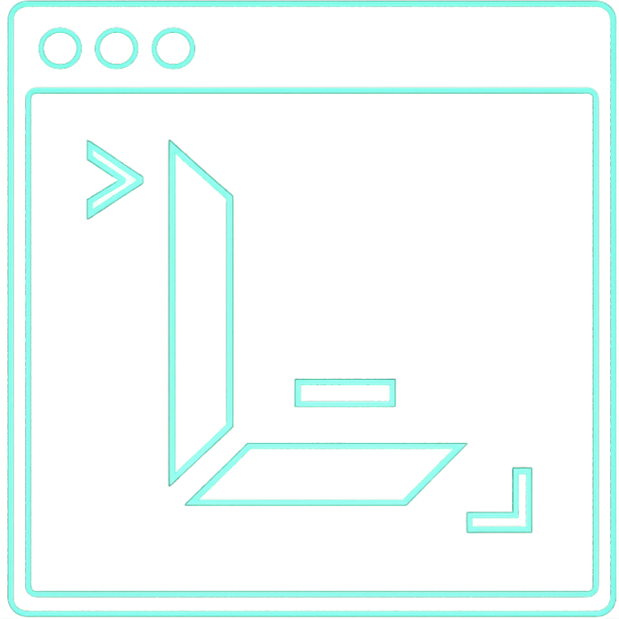
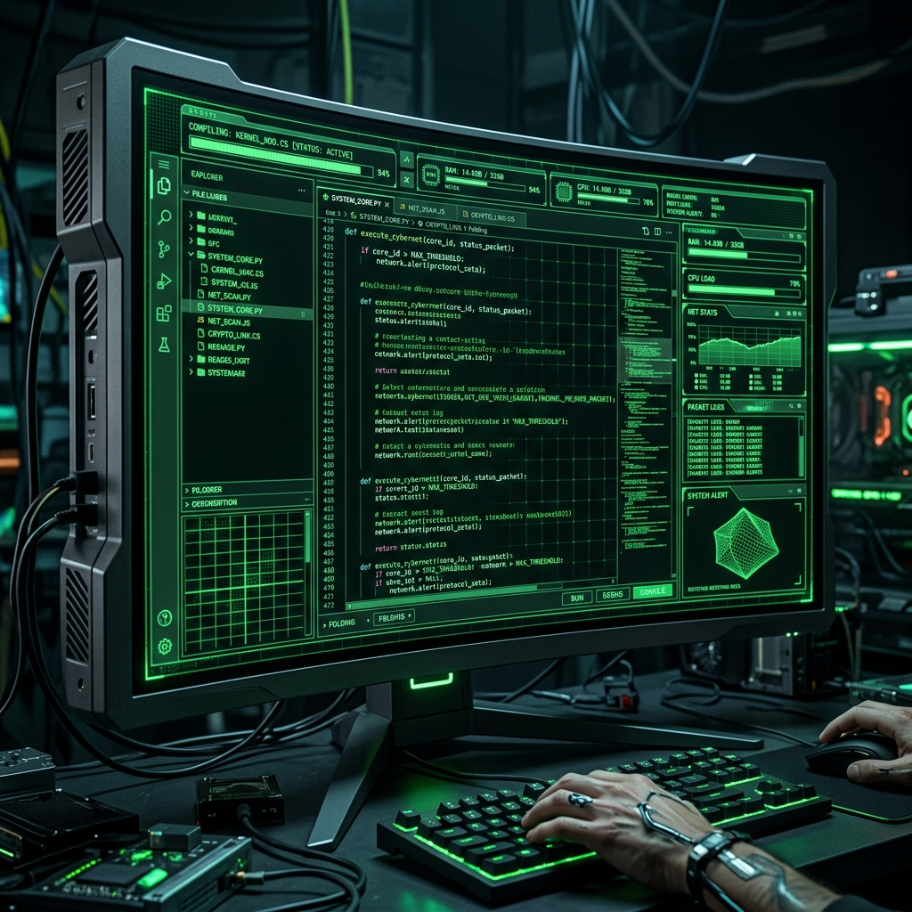
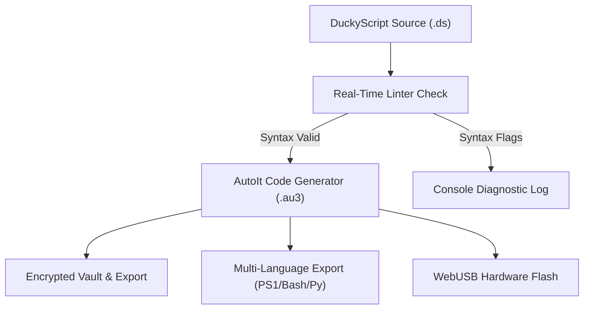

# <div align="center"><br>🟢 LENLU SC // CYBERNETIC FORGE DECK & MOBILE UPLINK 🟢</div>

<div align="center">

*A premium, high-fidelity command console and mobile terminal wrapper for real-world cryptographic audits, network scans, DuckyScript payload compilation, and hardware flashing.*

[](#)
[](#)
[](#)
[](#)

</div>

---

> [!IMPORTANT]
> **SECURE CLIENT-SIDE ISOLATION NOTICE**
> LENLU SC runs client-side operations locally. Payloads and diagnostics do not leave your browser or device context unless explicitly requested via user-configured neural API endpoints. AI features require your own API key entered in the AI Settings panel.

---

## ⚡ SYSTEM OVERVIEW

LENLU SC is an immersive, hardware-accelerated command console designed to bridge the gap between human-readable keyboard scripts and target host executable packages.

The console features:
* 🛠️ **DuckyScript Linter & Compiler**: Translates keystroke injection scripts into compiled AutoIt3 executables with real-time error checking and multi-language export (PS1, Bash, Python).
* 🧠 **Neural Synthesis Lab**: Multi-model AI payload generation (Groq, OpenAI, Anthropic) with voice dictation controls and stealth timing auto-calibrators.
* 📡 **Network Surveillance HUD**: Real DNS resolutions, service scanners (SSH, HTTP, HTTPS, DB, Cache), local WebSocket sweepers, BLE beacon tracking, and microphone frequency analyzers via Web Audio API.
* 🔌 **Hardware WebUSB Flasher**: Directly streams payloads to Flipper Zero (BadUSB), Rubber Ducky, or Arduino controllers using chunked transmissions.
* 🔓 **Web Crypto Hash Cracker**: Performs real-time dictionary attacks and brute-force hash-cracking utilizing Web Worker multi-threading.
* 📱 **Native Android App**: Edge-to-edge WebView wrapper with notch support, 5 daily push notifications, native BLE/WiFi scans, and full cyberpunk theme integration.

---

## 🖼️ INTERFACE SHOWCASE

<table align="center" style="border-collapse: collapse; border: none; width: 100%;">
  <tr style="border: none;">
    <td align="center" width="50%" style="border: none; padding: 10px; vertical-align: top;">
      <b>💻 Integrated Payload Workbench</b><br>
      <sub>Real-time DuckyScript linter, compiler, and local memory session cache.</sub><br><br>
      
    </td>
    <td align="center" width="50%" style="border: none; padding: 10px; vertical-align: top;">
      <b>🧠 Neural Synthesis Lab</b><br>
      <sub>Multi-model AI uplink with voice dictation and delay speed tuning.</sub><br><br>
      
    </td>
  </tr>
  <tr style="border: none;">
    <td align="center" width="50%" style="border: none; padding: 10px; vertical-align: top;">
      <b>📡 Network Surveillance HUD</b><br>
      <sub>Airspace simulation logging Wi-Fi networks, BLE node signatures, and packet streams.</sub><br><br>
      
    </td>
    <td align="center" width="50%" style="border: none; padding: 10px; vertical-align: top;">
      <b>📱 LENLU SC Android v4.0</b><br>
      <sub>Edge-to-edge native WebView with notch support, push notifications & API bridge.</sub><br><br>
      
    </td>
  </tr>
</table>

---

## 🛠️ CORE CHAMBERS

### 1. 💻 Integrated Payload Workbench
* **DuckyScript Compiler**: Translates keystroke inject scripts (`DELAY`, `STRING`, `GUI`, `ENTER`, `CTRL`, etc.) into AutoIt3 (`.au3`) and multi-language (PS1, Bash, Python) export.
* **Interactive Linter**: Continuously evaluates typed scripts inside the editor, flagging warnings and syntax anomalies directly inside the IDE log panel.
* **DuckyScript 3.0 Functions**: Full support for `FUNCTION`, `END_FUNCTION`, variable arguments, and recursive script blocks.
* **Persistent Cache**: Keeps your current workspace, active code, compiler logs, and open tab selections safe across browser sessions via IndexedDB.
* **60+ Template Library**: Pre-built payload templates for recon, persistence, pranks, automation, and credential auditing.

### 2. 🧠 Neural Synthesis Lab
* **Multi-Model Uplink**: Connects to AI models (Groq/Llama, OpenAI/GPT, Anthropic/Claude) via user-configured API keys in the Settings panel.
* **Offline Mode**: Rule-based DuckyScript generator works without any API key — generates payloads from natural language prompts locally.
* **Voice Dictation**: Integrated Web Speech APIs allow converting voice commands into functional scripts.
* **Stealth Calibrator**: Automatically scales script delay metrics per AI preset (Stealth / Troll / Recon / Persistence).
* **AI Copilot**: Forge AI assistant that can write scripts, navigate views, run scans, and execute IDE commands on command.

### 3. 📡 Network Surveillance HUD
* **DNS Resolution**: Resolves IP addresses and fingerprints hosts via Cloudflare's DNS-over-HTTPS (DoH) API.
* **Service Scan**: Fingerprints standard service layers across 21 common protocol ports with response-time heuristics.
* **BLE Beacon Tracker**: Simulated and real Web Bluetooth scans capturing RSSI, device name, MAC address, and estimated distance.
* **Subnet Sweep**: Async Class-C subnet scanner probing 25 hosts with visual IP chip grid output.
* **WebRTC Leak Check**: Safely queries RTC candidate tables to map out public and local network interfaces.
* **Speed Test**: Cloudflare-based download/upload speed test with animated gauge, latency, and jitter measurements.
* **Microphone Spectrograph**: Web Audio API FFT visualizer mapping ambient signal scans onto a WebGL canvas.

### 4. 🔌 WebUSB Hardware Flasher
* **Direct Flashing**: Connects via WebUSB (Chrome/Edge) to stream payloads to external hardware.
* **Handshake Protocol**: Implements a secure chunked transmission (`DUCK_READY` ➡️ `CHUNKS` ➡️ `DUCK_EXEC`).
* **Hardware Profile Registry**: Pre-loaded support for Rubber Ducky, Flipper Zero, and Arduino.

### 5. 🔓 Web Crypto Hash Cracker
* **Multi-Threaded**: Runs in isolated browser Web Workers to ensure 60 FPS UI performance during cracking.
* **Fast-Path Dictionary**: Checks target hashes against a built-in repository of common credentials.
* **Brute-Force Enumerator**: Brute-forces strings dynamically using customizable charsets (upper, lower, nums, symbols).

### 6. 📱 Android Native App (v4.0)
* **Edge-to-Edge Layout**: WebView draws behind status bar and navigation bar with dynamic safe area CSS variables (`--safe-top`, `--safe-bottom`).
* **Bottom Navigation Bar**: Fixed 7-tab bottom nav (Home, Dash, IDE, Neural, Tools, Vault, Config) visible on mobile — auto-syncs with top nav active state.
* **Logo Toggle Navigation**: Tap the LENLU SC logo (or hamburger icon) on mobile to toggle the top nav tabs open/closed.
* **Themed Radio Button Controls**: HUD Accent Color selector uses themed radio buttons with live color swatches instead of a dropdown.
* **Draggable AI Chatbot**: The floating Forge AI Copilot button and chat window can be dragged anywhere on screen (touch + mouse support).
* **Radio-Style Tool Selection**: Tools sidebar category buttons now display as radio-style indicators with active dot indicators.
* **Notch/Display Cutout Support**: `LAYOUT_IN_DISPLAY_CUTOUT_MODE_SHORT_EDGES` with programmatic status bar overlay.
* **5 Daily Push Notifications**: WorkManager-scheduled random Intel briefings, payload tips, and system status alerts — fires even when app is closed.
* **Reboot Persistence**: `BootReceiver` reschedules notifications automatically after device reboot.
* **Native BLE Scan**: Hardware-level Bluetooth LE scanner with RSSI data bridged to WebView via base64 JSON.
* **Native WiFi Scan**: `WifiManager` scan results with SSID, BSSID, signal level, frequency bridged to WebView.
* **Splash Screen**: Animated app icon splash screen via `SplashScreen` API.
* **Cyberpunk Theme**: Status bar transparent, white icons, matrix green accent, deep black backgrounds throughout.

---

## 🔔 NOTIFICATION SYSTEM

The Android app sends **5 randomized daily notifications** across 15+ notification templates in 6 categories:

| Category | Example |
|---|---|
| ⚡ System Status | "Neural uplink stable. All modules nominal." |
| 📡 Signal Intel | "BLE beacon activity detected nearby. Open scanner." |
| 🔍 OSINT Alerts | "Browser fingerprint entropy spike detected." |
| 💡 Payload Tips | "Use FUNCTION blocks in DuckyScript 3.0 for reusable sequences." |
| 🧠 AI Updates | "Neural payload generator ready. Describe your objective." |
| ⚙️ Activity Reminders | "Your last session payload is saved in the vault." |

Notifications are scheduled at approximately 8AM, 11AM, 2PM, 5PM, and 8PM with ±30 minute random jitter. They use the **Matrix Green (#00FF41)** LED light color and a `[80ms, pause, 80ms]` vibration pattern.

---

## 🔄 COMPILATION & ARCHITECTURE FLOW


```mermaid
graph TD
    A["DuckyScript Source (.ds)"] --> B["Real-Time Linter Check"]
    B -- "Syntax Valid" --> C["AutoIt Code Generator (.au3)"]
    B -- "Syntax Flags" --> D["Console Diagnostic Log"]
    C --> E["Encrypted Vault & Export"]
    C --> F["Multi-Language Export (PS1/Bash/Py)"]
    C --> G["WebUSB Hardware Flash"]
```

```
┌─────────────────────────────────────────────┐
│      LENLU SC v4.0 CORE SYSTEM              │
├─────────────────────────────────────────────┤
│  Web Layer                                   │
│  ├── 1. IndexedDB Persistence (Vault+Hist)  │
│  ├── 2. Web Worker Threads (Hash Cracker)   │
│  ├── 3. WebGL Particle Engine (Three.js)    │
│  ├── 4. Web Audio API (FFT Spectrum)        │
│  └── 5. WebUSB Hardware Bridge              │
│                                              │
│  Android Native Layer                        │
│  ├── 6. WorkManager (5 Daily Notifications) │
│  ├── 7. BluetoothLeScanner (BLE Scan)       │
│  ├── 8. WifiManager (WiFi Scan)             │
│  ├── 9. FileProvider (File Export/Share)    │
│  └── 10. BootReceiver (Notif Persistence)   │
├─────────────────────────────────────────────┤
│  Data Flow: WebView ↔ JavascriptInterface   │
│  Persistence: IndexedDB + SharedPreferences │
│  Async: Coroutines + WorkManager            │
└─────────────────────────────────────────────┘
```

---

## 📁 DIRECTORY STRUCTURE

```
LENLU-SC/
├── src/                          Web console source
│   ├── js/
│   │   ├── main.js              Core loader, boot, view router
│   │   ├── state.js             Global app state & constants
│   │   ├── db.js                IndexedDB async adapter
│   │   ├── compiler.js          DuckyScript parser, linter, codegen
│   │   ├── ui.js                Visual HUD, themes, canvas engines
│   │   ├── network.js           BLE, WiFi, DNS, port scanning
│   │   ├── shell.js             Terminal shell & OSINT fingerprinter
│   │   ├── vault.js             Encrypted payload vault manager
│   │   ├── crypto.js            Hash cracker (Web Workers)
│   │   ├── compliance.js        MITRE ATT&CK framework viewer
│   │   └── forge-extensions.js  Extra tools (JSON, passwords, etc.)
│   ├── css/
│   │   ├── base.css             Core cyberpunk design system
│   │   └── forge-fixes.css      Component overrides & fixes
│   └── index.html               Entry HTML (dev server)
│
├── api/                          Vercel serverless API
│   ├── auth/login.js            Admin JWT authentication
│   ├── content.js               CMS content read/write
│   └── lib/db-helper.js         MongoDB + local JSON fallback
│
├── appp/                         Android application module
│   └── src/main/
│       ├── java/com/lenlu/sc/
│       │   ├── MainActivity.kt          Edge-to-edge WebView host
│       │   ├── WebAppInterface.kt       JS bridge (BLE, WiFi, clipboard...)
│       │   ├── NotificationWorker.kt    WorkManager daily notifications
│       │   └── BootReceiver.kt         Reschedule on device reboot
│       ├── res/
│       │   ├── layout/activity_main.xml  DrawerLayout + WebView + BottomNav
│       │   ├── layout/nav_header.xml     Drawer header with LENLU SC branding
│       │   ├── values/themes.xml         Cyberpunk theme + Splash screen
│       │   ├── values/colors.xml         Matrix green + Cyan palette
│       │   ├── menu/bottom_nav_menu.xml  5-tab bottom navigation
│       │   └── menu/drawer_nav_menu.xml  Full 16-view drawer navigation
│       └── AndroidManifest.xml           Permissions + components
│
├── .env.example                  Environment variable template
├── vercel.json                   Vercel deployment config
├── vite.config.js                Vite build + local API middleware
└── package.json                  Node dependencies
```

---

## 🚀 UPLINK & DEPLOYMENT PROCEDURE

### 🌐 Web Console (Development & Production)

#### 1. Setup Dependencies
```bash
npm install
```

#### 2. Run Local Development Server
```bash
npm run dev
```
Open `http://localhost:5173` — the Vite dev server includes local API middleware for auth and content endpoints.

#### 3. Build for Production
```bash
npm run build
```
The build process compiles everything into a single, fully-inlined file at `src/dist/index.html` and automatically copies it to:
- Project root: `index.html`
- Android assets: `appp/src/main/assets/index.html`

> [!NOTE]
> The compiled `index.html` files are excluded from git (via `.gitignore`). Regenerate on demand with `npm run build`.

#### 4. Deployment on Vercel
The repository includes a [`vercel.json`](./vercel.json) configured for Vite builds:
1. Connect this repository to your Vercel project.
2. Vercel auto-detects `vercel.json` and sets build config.
3. Serverless API functions in `api/` are deployed automatically.

> [!WARNING]
> WebUSB, Web Crypto, and Speech Recognition require **HTTPS**. Vercel enables this by default.

#### 5. Environment Variables
Copy `.env.example` to `.env` and configure:
```env
MONGODB_URI=mongodb+srv://...           # Optional: MongoDB for persistent content storage
ADMIN_JWT_SECRET=your-secret-here       # JWT signing secret for admin panel
ADMIN_PASSWORD_LENLU=your-password      # Admin user 1 password
ADMIN_PASSWORD_MANISHA=your-password    # Admin user 2 password
```

---

### 📱 Android Application

#### Prerequisites
- Android Studio Hedgehog (2023.1.1) or newer
- Android SDK 34
- JDK 8+

#### Build Steps

```bash
# 1. Build the web assets (REQUIRED before building APK)
npm run build

# 2. Build debug APK
./gradlew :appp:assembleDebug

# 3. Install directly to connected device
./gradlew :appp:installDebug

# 4. Build release APK
./gradlew :appp:assembleRelease
```

Or open the project in Android Studio → **Build → Run 'appp'**

#### Android Feature Matrix

| Feature | Implementation | API Level |
|---|---|---|
| Edge-to-Edge layout | `WindowCompat.setDecorFitsSystemWindows(false)` | 21+ |
| Bottom Navigation Bar | HTML/CSS fixed bottom nav with JS sync | 21+ |
| Logo Toggle Nav | JS click handler on brand/hamburger | 21+ |
| Themed Radio Buttons | HTML radio inputs with CSS custom properties | 21+ |
| Draggable Chatbot | Mouse + touch drag with viewport clamping | 21+ |
| Notch/Cutout support | `LAYOUT_IN_DISPLAY_CUTOUT_MODE_SHORT_EDGES` | 28+ |
| Splash Screen | `SplashScreen` API (`core-splashscreen:1.0.1`) | 21+ |
| Daily Notifications | `WorkManager` OneTimeWorkRequest (×5/day) | 21+ |
| Notification Permission | `POST_NOTIFICATIONS` runtime request | 33+ |
| Boot Persistence | `RECEIVE_BOOT_COMPLETED` BroadcastReceiver | 21+ |
| Native BLE Scan | `BluetoothLeScanner` → base64 bridge | 21+ |
| Native WiFi Scan | `WifiManager.startScan()` → base64 bridge | 21+ |
| File Export/Share | `FileProvider` + `ACTION_SEND` | 21+ |
| Clipboard Bridge | `ClipboardManager` JS interface | 21+ |

---

## ⚙️ TELEMETRY SYSTEM STATUS

| Parameter | State | Description |
| :--- | :--- | :--- |
| **Compiler Pipeline** | `CALIBRATED` | Full DuckyScript 3.0 conversion map with function blocks. |
| **WebGL Shaders** | `ACTIVE` | Ambient parallax particle matrices at 60 FPS target. |
| **Session Cache** | `ENABLED` | IndexedDB tracking vault, history, and editor state. |
| **Encryption Mode** | `SANDBOX` | Client-side memory only — data stays in your browser. |
| **Android Inset Bridge** | `OPERATIONAL` | Dynamic CSS `--safe-top` / `--safe-bottom` from native insets. |
| **Notification Engine** | `SCHEDULED` | 5 WorkManager tasks firing daily across 15+ templates. |
| **Neural Uplink** | `USER-KEY` | AI features require your own API key. Offline fallback active. |

---

## 🔐 SECURITY NOTES

> [!CAUTION]
> LENLU SC is designed for **authorized security research, education, and personal automation** only. DuckyScript payloads and network scanning tools are provided for learning and testing on systems you own or have explicit permission to test. Never use these tools against systems without written authorization.

- All processing is client-side — no payloads or scan results are sent to external servers
- AI API keys are stored in your browser's `localStorage` only — never transmitted to our servers
- The admin CMS panel (if deployed on Vercel) uses HMAC-SHA256 signed session tokens
- Hardcoded credentials have been removed from the codebase — configure via `.env` file

---

<div align="center">

**// END OF LINE.** // Maintain precision. Assemble with control.

*LENLU SC v4.0 — Built by Arunesh*

</div>
